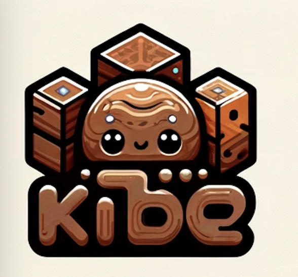
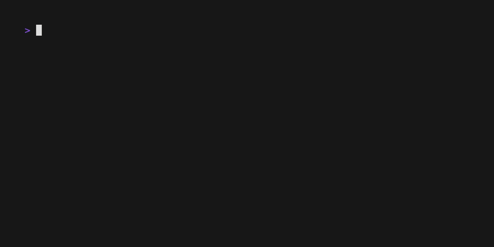
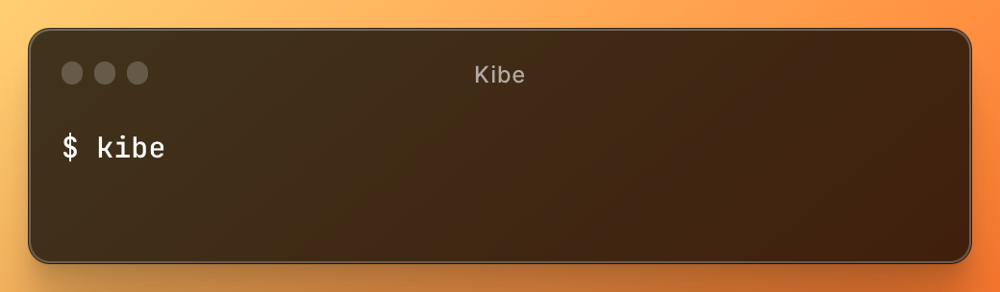

# Kibe

What is `kibe`? 

For brazilians, it's a delicious arab snack sold in street bars and bakeries, eatten on birthdays, parties, events or just on a busy day without much time to lunch.  

For developers, SREs, Platform Engineers or whatever role in which you are responsible for Kubernetes or just need to interact with resources created on it, `kibe` it's a simple interactive terminal-based command with an elegant interface that helps you to navigate across resources and execute operations on different clusters without the effort of writing commands each time.

If you are both, the command is as delicious as a kibe with lemon or ketchup!  

## Usage

Just call for a `kibe` and put some ketchup!

The interface has different kind of views, which can be a list, a table, etc. To interact with these views, just follow the help located below. It shows every key binding you need to know to execute operations.

## Why?

As a Platform Engineer, I like to have a toolbelt with a lot of tools to get things done. Kibe is one of these tools, which I can bring with me to whatever context I'm working on (companies, freelance jobs, study, personal projects, etc.).

I'm a intesive user of k9s and I really love its concept. It's my main tool to interact with Kubernetes today. There is only one thing that bothers me: it looks like `top`, which reminds me of sysadmin age (sorry millenials). 

I wanted to make a tool that has the simplicity of k9s and can look beautiful and elegant on modern terminals.  

Also, as a personal project, I wanted to try a [TUI](https://en.wikipedia.org/wiki/Text-based_user_interface) framework called [Bubble Tea](https://github.com/charmbracelet/bubbletea), from [Charm](https://charm.sh/). This lib is intended to facilitate the creation of terminal interfaces, offering different models and mechanisms for Go apps.  

Finally, why not a GUI? Well, it's just a personal taste. I like to make things in terminal.

## Current status

Kibe is still in development, and should be released when I achieve a MVP. This means that Kibe needs the following capabilities:

- Manage simple resources:
  - Pod
  - Deployment
  - Service
  - Ingress
  - Job
  - Cronjob
  - ServiceAccount
  - Secret
  - ConfigMap
  - Node
  - Namespace
- Displays 4 different views, based on the action:
  - The Kubernetes resources listed above as Tables with basic information about each item
  - Client configuration with context, namespace and resource type selection as List
  - Object inspection (just like a `kubectl describe $resource_type`) with categories as Tabs (a Tab for overview metadata, a Tab for secrets and configmas, a Tab for connection data, etc.)
  - Logs visualization

You can follow the project progress [here](https://github.com/users/momarques/projects/1).